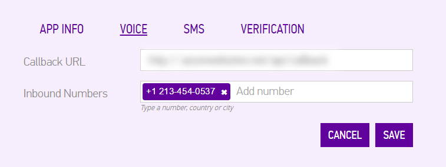

# Keep users phone numbers private in your Uber for X

The Ubers for X have two very interesting common denominators: A decentralized workforce, and a need for real-time communication. With <a href="http://ben-evans.com/benedictevans/2015/6/19/presentation-mobile-is-eating-the-world" target="_blank">the world turning mobile</a>, our phone numbers are the most precious thing we own, and like with all precious things, we want to keep it safe and sound - and away from strangers.

<a href="https://www.sinch.com/ideas/anonymous-calling-demand/" target="_blank">The gig economy is compromising user privacy</a> on a grass root level. The brilliance in decentralizing responsibility while upping speed, availability and competitive pricing, also implies users worrying about throwing their phone numbers around to “strangers”. That’s why <a href= "https://www.sinch.com/features/anonymous-calling/" target="_blank">protecting users phone numbers</a>  will add some serious value to an <a href="https://www.sinch.com/learn/demand-revolution/" target="_blank">Uber for X</a> solution.

And once the on-demand novelty has worn off, basic needs such as user privacy gets even more important for services to stay competitive on a refined market, and attract the late majority consumers to keep a growing business.

So let's start building.

##How to add Anonymous Calling
In this tutorial we're building a super simple API using C# to redirect phone calls to a given number using our SVAML. We'll use the caller ID of the calling party to determine where to connect the call. The flow of the calls in this kind of solution looks like this:


<br>

In this tutorial, we are going to implement the backend part.

As usual, you can find the full source code on [GitHub](https://github.com/sinch/net-redirect-call) or deploy directly to your Azure account if you want to try it out.

[] (https://azuredeploy.net/?repository=https://github.com/sinch/csharp-nps-sms-delighted)


## Prerequisites 
1. A [Sinch account](https://www.sinch.com/signup) and an app with keys 
2. A phone number [rented from Sinch] (https://www.sinch.com/dashboard/#/numbers); make sure it’s a voice number

## Configure your app 
Once you have a phone number - in my case +1 213-454-0537 - assign it to your app by clicking on the pen and then Voice:



Enter a callback URL. This is the URL the Sinch service will hit when there is a call happening associated with your app. 
 
## Code
*This service is going to have two endpoints: one for associating a Caller ID with a specific phone number and one for the actual callback URL for the Sinch backend.*

## Configure API
I am going to store the configuration in memory, so let’s create a simple model to keep track of the “from” and “to” numbers. 

```csharp
namespace Models {
    public class NumberConfigContext
    {
        private static List<NumberConfig> _numberConfigs;
        public static List<NumberConfig> Current()
        {
            if (_numberConfigs == null)
                _numberConfigs = new List<NumberConfig>();
            return _numberConfigs;
        }
    }
    public class NumberConfig {
        public string From { get; set; }
        public string To { get; set; }
    }
}
```
The above code just adds a static list with configs, where “from” is the calling phone and “to” is the phone to which we want it to be connected. I abstracted this for your benefit, so you can have an internal service like this that is entirely decoupled from your user database. 

Next, let’s add an endpoint in our WebAPI to configure where we want to connect.
<br>

**ConfigureController.cs**

```csharp
[HttpPost]
public void Post(string from, string to) {
    // make sure we dont have duplicates
    NumberConfigContext.Current().RemoveAll(n => n.From == from);
    var config = new NumberConfig {
        From = from,
        To = to
    };
    NumberConfigContext.Current().Add(config);
}
```
Let's build a list current configs to:

```csharp
[HttpGet]
public List<NumberConfig> Get() {
    return NumberConfigContext.Current();
}
```
Build this and **POST** the following URL with [Postman](https://www.getpostman.com/) 

`http://yourserver/api/Configure?from=+15612600684&to=+460000000000`

Then, **GET** `http://yourserver/api/Configure` and you should see that we successfully added a config. 

## Implementing the callback controller 
Create WebAPI controller called **SinchController**; this controller will be responsible for parsing and responding to SVAML. Sinch swag CTO Björn Fransson is sharing his NuGet with all the SVAML we support, including some undocumented features—can you spot them? For the list of supported SVAML, check out the [documentation](https://www.sinch.com/docs/voice/rest/#callbackapi "Callback documentation") if you prefer to make it yourself instead of NuGet.

```nugetgithub
pm> Install-Package Sinch.ServerSdk 
```
And now the actual code:

```csharp
public SvamletModel Post(CallbackEventModel model) {
	var sinch = SinchFactory.CreateCallbackResponseFactory(Locale.EnUs);
	SvamletModel result = null;
    var builder = sinch.CreateIceSvamletBuilder();
    if (NumberConfigContext.Current().Any(c => c.From == model.From)) {
    	var config = NumberConfigContext.Current().FirstOrDefault(c => c.From == model.From);
        result = builder.ConnectPstn(config.To).WithCli(model.To.Endpoint).WithoutCallbacks().Model;
	} else {
		result = builder.Say("Invalid caller id!").Hangup().Model;
	}
	return result;
}

```
As you can see in the above code, it’s super simple to create some pretty nice functionality with just a few lines of code. Note that we are replacing the Caller ID with the number the user dialed - in my case, the Los Angeles number - to keep both users’ numbers private.

## What’s next?
This tutorial relies on Caller ID, which can be a little flaky since the user might not display it. In our experience, it still works well with Sinch, and many of our customers rely on Caller ID for their solutions. Alternatively, you could rent multiple numbers from us (you can determine how many with the maximum concurrent number of calls you need to support) and connect to the right number using destination only.

None of this is magic, it's just upping your Uber for X solution with real-time in-app communication. I mean who wouldn’t want to create company valued north of 50bn, right?
